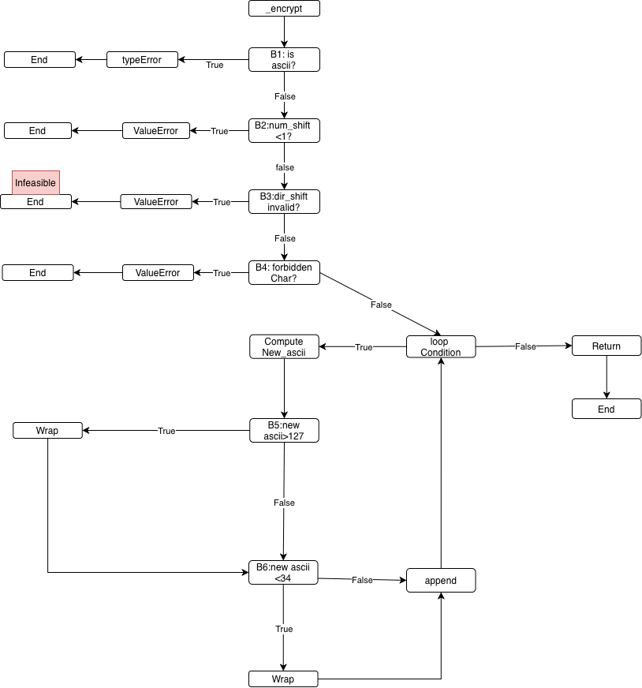

# _encrypt() Analysis

## CFG

*Figure 1: Control Flow Graph for _encrypt()*

## Nodes
N1: start
N2: B1: input_text.isascii()?
N3: Raise TypeError
N4: B2: num_shift <1?
N5: Raise ValueError (num_shift)
N6: B3: dir_shift < -1 AND dir_shift > 1? (unsatisfiable predicate BUG)
N7: Raise ValueError(dir_shift)(infeasible: dead code due to unsatisfiable predicate)
N8: B4: forbidden char present?
N9: Raise ValueError(forbidden char)
N10: Reverse string and init loop
N11: Loop condition(for char in input_text)
N12: Compute new_ascii
N13: B5: new_ascii > 127?
N14: Wrap high(new_ascii -=128)
N15: B6: new_ascii < 34
N16: Wrap low(new_ascii += 128)
N17: Append shifted char
N18: Return encrypted string
N19: End

...

## Edges
(N1 → N2)
(N2 True → N3)
(N2 False → N4)
(N4 True → N5)
(N4 False → N6)
(N6 True → N7) infeasible
(N6 False → N8)
(N8 True → N9)
(N8 False → N10)
(N10 → N11)
(N11 True → N12)
(N11 False → N18)
(N12 → N13)
(N13 True → N14)
(N13 False → N15)
(N14 → N17)
(N15 True → N16)
(N15 False → N17)
(N16 → N17)
(N17 → N11)
(N18 → N19)

## Prime Path Set
- N1 -> N2 -> N3 Error path non-ASCII
- N1 -> N2 -> N4 -> N5 Error path num_shift
- N1 -> N2 -> N4 -> N6 -> N8 -> N10 Error path forbidden char
- N1 -> N2 -> N4 -> N6 -> N8 -> N10 -> N11 -> N12 -> N13 -> N14 -> N17 -> N11 Valid path wrap-high
- N1 -> N2 -> N4 -> N6 -> N8 -> N10 -> N11 -> N12 -> N13 -> N15 -> N17 -> N11 Valid path no-wrap
- N1 -> N2 -> N4 -> N6 -> N8 -> N10 -> N11 -> N12 -> N13 -> N15 -> N16 -> N17 Valid path wrap-low
- N11 -> N18 -> N19 Loop cycle path through appended back t loop condition
- N6 -> N7 Infeasible path through N6 True (excluded)

## Infeasibility Proof
Let :
A = dir_shift < -1
B = dir_shift > 1

Predicate is P = A AND B

No real value can be both less than -1 and greater than 1 at the same time. 
So P is always false.

Therefore the True branch at N6 is infeasible and should be excluded from the feasible 
branch requirement counts.

## CACC Note
Since P is unsatisfiable, there is no test pair that makes clause A determine P 
or clause B determine P with P switching True/False as required CACC.

CACC requirement for predicate at B3 is infeasible by logic.

...

## Coverage Requirements
- Node coverage: All nodes N1-N19 must be visited, except N7 (infeaseible)
- Edge coverage: All edges must be covered except: (N6 -> N7) which is infeasible
- Prime paths: All feasible prime paths listed above must be covered. The path through N6 -> N7 is excluded due to infeasibility.

## Note
The predicate at N6 represents a logical defect in the program. It fails to correctly validate dir_shift, allowing invalid values (0,2,-2) to pass without raising an error.

## update as needed