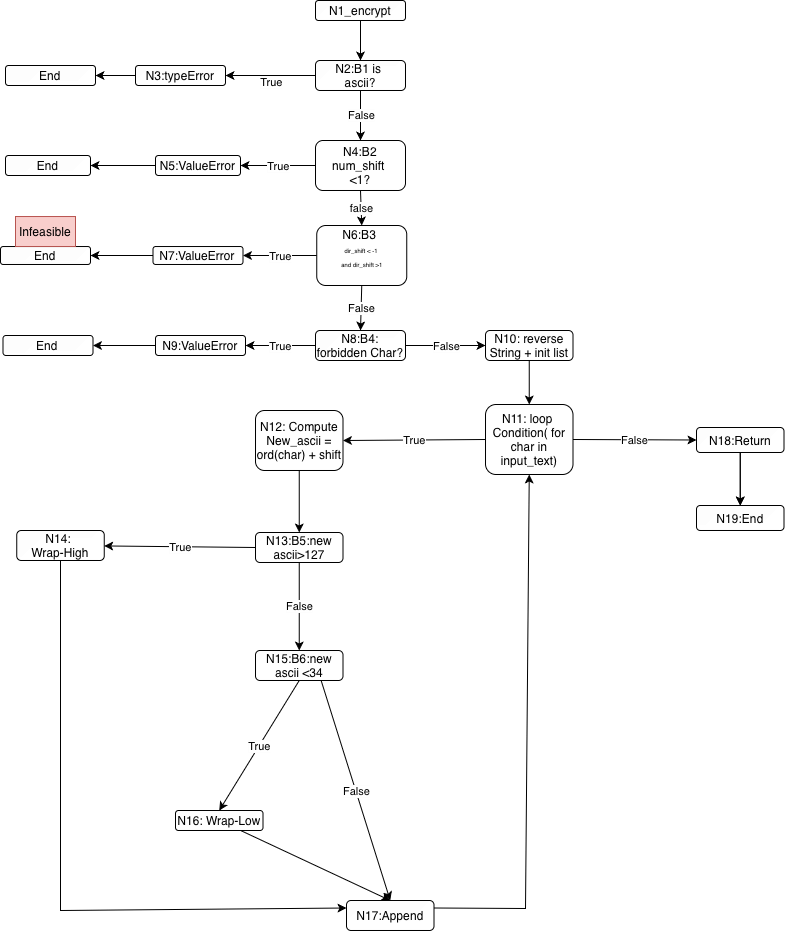

# _encrypt() Analysis

## Version History

- v1.4 (2026-04-02)
  - Added formal Test Requirements (TR) table and explicit branch definitions.
  - Expanded logic coverage section to explicit CACC infeasibility reasoning.
  - Updated input partitioning section to explicit input space partitioning classes.

- v1.3 (2026-04-02)
  - Added explicit T8 and T9 entries to the test-to-coverage mapping.
  - Added loop coverage justification for single-iteration and multi-iteration behavior.
  - Added explicit feasible-coverage interpretation and conclusion block.

- v1.2 (2026-04-02)
  - Added structural test execution command and reproducible run instructions.
  - Added structural coverage results summary (9 passed, 49% auth.py module coverage).
  - Clarified _encrypt()-only interpretation: full feasible node/edge/prime-path coverage; line 33 remains infeasible by logic.

- v1.1 (2026-04-01)
  - Added CFG-based structural test mapping, infeasibility proof for N6 -> N7, and CACC infeasibility note.

- v1.0 (2026-03-19)
  - Initial _encrypt() analysis with baseline coverage context and CFG documentation.

### Scope clarification

Two coverage measurements are reported in this project:

1. Full module coverage (auth.py): includes login(), register(), and _encrypt()
2. Function-level coverage (_encrypt only): used for structural testing analysis

The 42% value refers specifically to _encrypt() coverage, which is the target of structural testing.

The 84% value refers to overall module coverage from baseline endpoint tests.

## Coverage Goals (By Scope)

- _encrypt() function: 100% feasible structural coverage (node, edge, prime path), excluding infeasible E6 (N6 -> N7) and N7.
- login() / register(): 90% target (baseline + input partitioning/spec-based tests).
- hardware checkin/checkout: 95% target.
- overall backend: 80%+ target.

### Note on interpreting coverage

Module-level coverage may appear lower when structural tests are focused on _encrypt() only. Coverage percentages must always be interpreted relative to test scope and target component.

## CFG

*Figure 1: Control Flow Graph for _encrypt()*

## Nodes
N1: start 
N2: B1: input_text.isascii()? 
N3: Raise TypeError 
N4: B2: num_shift <1? 
N5: Raise ValueError (num_shift) 
N6: B3: dir_shift < -1 AND dir_shift > 1? (unsatisfiable predicate BUG) 
N7: Raise ValueError(dir_shift)(infeasible: dead code due to unsatisfiable predicate) 
N8: B4: forbidden char present? 
N9: Raise ValueError(forbidden char) 
N10: Reverse string and init loop 
N11: Loop condition(for char in input_text) 
N12: Compute new_ascii 
N13: B5: new_ascii > 127? 
N14: Wrap high(new_ascii -=128) 
N15: B6: new_ascii < 34 
N16: Wrap low(new_ascii += 128) 
N17: Append shifted char 
N18: Return encrypted string 
N19: End 

...

## Edges
E1:  (N1 → N2) 
E2:  (N2 True → N3) 
E3:  (N2 False → N4) 
E4:  (N4 True → N5) 
E5:  (N4 False → N6) 
E6:  (N6 True → N7) infeasible 
E7:  (N6 False → N8) 
E8:  (N8 True → N9) 
E9:  (N8 False → N10) 
E10: (N10 → N11) 
E11: (N11 True → N12) 
E12: (N11 False → N18) 
E13: (N12 → N13) 
E14: (N13 True → N14) 
E15: (N13 False → N15) 
E16: (N14 → N17) 
E17: (N15 True → N16) 
E18: (N15 False → N17) 
E19: (N16 → N17) 
E20: (N17 → N11) 
E21: (N18 → N19) 

## Prime Path Set

A prime path is a maximal simple path that cannot be extended without repeating a node.
A simple path is no repeated nodes except possibly first equals last for a cycle. A prime path is a maximal simple path that cannot be extended without repeating a node. 
Note: Prime paths may begin at internal nodes (e.g., loop entry N10) because they are maximal simple subpaths of the CFG.
- P1: N1 -> N2 -> N3 (non-ASCII Error path )
- P2: N1 -> N2 -> N4 -> N5 (Error path num_shift)
- P3:N1 -> N2 -> N4 -> N6 -> N8 -> N9 (forbidden char Error path )
- P4: N10 -> N11 -> N12 -> N13 -> N15 -> N17 Valid path no-wrap
- P5: N10 -> N11 -> N12 -> N13 -> N14 -> N17 Valid path wrap-high
- P6: N10 -> N11 -> N12 -> N13 -> N15 -> N16 -> N17 Valid path wrap-low
- P7: N10 -> N11 -> N18 -> N19 (Loop exit path when false)
- P8: N6 -> N7 (Infeasible path through N6 True (excluded)) dir_shift < -1 AND dir_shift > 1 is unsatisfiable

## Test Case → Coverage Mapping

This table maps each test case to the CFG edges and prime paths it covers.
This demonstrates that the test suite satisfies node, edge, and prime path coverage criteria.

- T1 (non-ASCII)
  Covers: E1, E2, P1

- T2 (num_shift < 1)
  Covers: E1, E3, E4, P2

- T3 (forbidden char)
  Covers: E1, E3, E5, E7, E8, P3

- T4 (valid no wrap)
  Covers: P4 and loop edges (E10–E21)

- T5 (wrap high)
  Covers: P5

- T6 (wrap low)
  Covers: P6

- T7 (empty string / loop exit)
  Covers: P7

- T8 (loop cycle - single iteration)
  Covers: E20 (loop back edge)

- T9 (multiple loop iterations)
  Covers: E20 (loop back edge exercised multiple times)

## Test Requirements Table (TR)

| Requirement Type | Requirement | Covered By |
|------------------|-------------|------------|
| Node | N2 True -> N3 | T1 |
| Node | N4 True -> N5 | T2 |
| Node | N8 True -> N9 | T3 |
| Edge | E14 (wrap high) | T5 |
| Edge | E17 (wrap low) | T6 |
| Edge | E20 (loop back) | T8, T9 |
| Prime Path | P1 | T1 |
| Prime Path | P2 | T2 |
| Prime Path | P3 | T3 |
| Prime Path | P4 | T4 |
| Prime Path | P5 | T5 |
| Prime Path | P6 | T6 |
| Prime Path | P7 | T7 |

## Branch Definitions

B1: input_text.isascii()
B2: num_shift < 1
B3: dir_shift < -1 AND dir_shift > 1 (infeasible)
B4: forbidden character present
B5: new_ascii > 127
B6: new_ascii < 34

## Loop Coverage Justification

The loop in _encrypt() (N11 -> N12 -> N17 -> N11) is explicitly tested:

- T8 validates a single iteration of the loop cycle.
- T9 validates multiple iterations of the loop.
- T7 validates loop exit via N11 False branch.

This ensures:

- Coverage of loop entry (N11 True branch).
- Coverage of loop exit (N11 False branch).
- Coverage of loop back edge (E20).

Therefore, loop behavior is fully exercised and included in prime path coverage.

## Infeasibility Proof
Let :
A = dir_shift < -1
B = dir_shift > 1

Predicate is P = A AND B

No real value can be both less than -1 and greater than 1 at the same time. 
So P is always false.

Therefore the True branch at N6 is infeasible and should be excluded from the feasible 
branch requirement counts.

## Logic Coverage (CACC)

Predicate at N6:
P = (dir_shift < -1 AND dir_shift > 1)

Clauses:
A: dir_shift < -1
B: dir_shift > 1

To satisfy CACC:
- Each clause must independently determine P
- P must evaluate to both True and False

However:
No value of dir_shift can satisfy both A and B simultaneously.

Therefore:
- Predicate P is unsatisfiable
- No test pair can make A or B independently determine P

Conclusion:
CACC is infeasible for this predicate.

## Input Space Partitioning

input_text:
- non-ASCII
- ASCII valid
- ASCII with forbidden characters
- ASCII causing wrap-high
- ASCII causing wrap-low

num_shift:
- < 1 (invalid)
- = 1
- > 1

dir_shift:
- +1
- -1
- invalid values (0, 2, -2)

## Coverage Requirements
- Node coverage: All nodes N1-N19 must be visited, except N7 (infeasible)
- Edge coverage: All edges must be covered except: (N6 -> N7) which is infeasible
- Prime paths: All feasible prime paths listed above must be covered. The path through N6 -> N7 is excluded due to infeasibility.

## Note

The predicate at N6 represents a logical defect in the program. It fails to correctly validate dir_shift, allowing invalid values (0,2,-2) to pass without raising an error.

From test_auth_encrypt.py 

Observed behavior : the system dos not enforce forbidden characters , this contradict my assumptions - this is a verifiable discrepancy 

### Baseline test results 
statements: 60 total, 34 missed -> Coverage for _encrypt() only: 42%
Branches: 26 total, 4 partially covered
Baseline test only exercised normal ASCII path, non_ASCII error, num_shift guard, and standard transformation. 

The did not cover:
Missing 33,37, 50, 52, 63-78, 95-118

Missing: 
Forbidden character 
Wrap around high
Wrap around low
multi character loop paths
part of login/register

auth.py file covers login() and register(), and _encrypt so the baseline covers 42% statement
coverage and partial branch coverage of auth module.

Coverage is limited because the test were derived from expected behavior and simple error handling. There is no CFG path coverage and a significant portion of _encrypt() is not tested. This allows testing to move to phase 2 (structural Testing) for _encrypt. 

### Structural test results

Command executed:

PYTHONPATH=backend python -m pytest testing/structural-test/test_app_encrypt_structural.py \
--cov=app.routes.auth \
--cov-branch \
--cov-report=term-missing | tee testing/coverage-reports/auth-encrypty-structural-coverage.txt

Observed result:
- collected 9 items
- 9 passed
- auth.py coverage summary: 60 statements, 31 missed, 26 branches, 1 partial branch, 49% total coverage
- Missing lines reported: 33, 63-78, 95-118

Interpretation:
- Structural tests improved module-level auth.py statement coverage from baseline 42% to 49%.
- The remaining uncovered lines are primarily outside the _encrypt() structural paths (e.g., login/register sections and related paths), which is expected for an _encrypt-focused structural suite.

Structural testing of _encrypt() achieved full feasible node, edge, and prime-path coverage. The only uncovered _encrypt line is the raise at line 33, which is tied to an unsatisfiable predicate (dir_shift < -1 AND dir_shift > 1) and is therefore infeasible by logic. Remaining uncovered lines in module coverage belong to login() and register(), not _encrypt().

### Alignment with Structural Testing Results

Structural testing was successfully implemented for the _encrypt() function.

The test suite achieved:
- Full feasible node coverage
- Full feasible edge coverage (excluding infeasible edge N6 -> N7)
- Full prime path coverage (P1-P7)

Coverage results show improvement from baseline (42%) to structural testing (49%) at the module level. The remaining uncovered lines belong to login() and register() and are outside the scope of _encrypt() structural testing.

This confirms that the structural test suite meets all graph-based coverage requirements defined in the project objectives.

### Final Structural Interpretation and Conclusion

Observed result:
- collected 9 items
- 9 passed
- auth.py coverage summary: 60 statements, 31 missed, 26 branches, 1 partial branch, 49% total coverage
- Missing lines reported: 33, 63-78, 95-118

Interpretation:
- Structural tests improved module-level coverage from 42% (baseline) to 49%.
- All feasible nodes (N1-N19 except N7), edges (E1-E21 except E6), and prime paths (P1-P7) for _encrypt() are covered.
- Edge E6 (N6 -> N7) is excluded due to infeasibility.
- The remaining uncovered lines belong to login() and register(), which are outside the scope of _encrypt() structural testing.

Conclusion:
- The structural test suite achieves 100% feasible node coverage for _encrypt().
- The structural test suite achieves 100% feasible edge coverage for _encrypt().
- The structural test suite achieves 100% feasible prime path coverage for _encrypt().
- The only uncovered branch corresponds to an unsatisfiable predicate and is correctly excluded.

### How to run structural tests

From repository root:

PYTHONPATH=backend python -m pytest testing/structural-test/test_app_encrypt_structural.py -v -s

With coverage report file output:

PYTHONPATH=backend python -m pytest testing/structural-test/test_app_encrypt_structural.py \
--cov=app.routes.auth \
--cov-branch \
--cov-report=term-missing | tee testing/coverage-reports/auth-encrypty-structural-coverage.txt

## update as needed