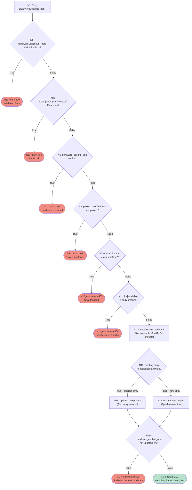
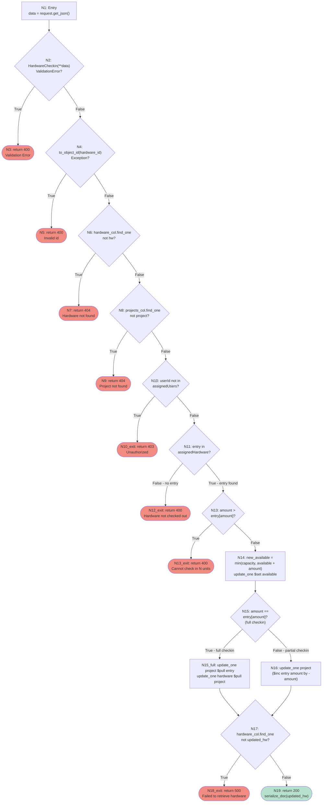

# checkout_hardware & checkin_hardware Analysis

## Overview

* Complete analysis with CFG, prime paths, CACC logic coverage, and ISP for checkout_hardware and checkin_hardware.
* Mermaid diagrams for both functions; node/edge/prime path tables; infeasibility proofs.
* Test case to prime path mapping across all three test suites (structural, CACC, ISP).

---

## Scope

Functions under test: `checkout_hardware` and `checkin_hardware` in `backend/app/routes/hardware.py`.

Three test suites exercise these functions:

| Suite | File | Technique |
|---|---|---|
| Structural | `testing/structural-test/test_checkout_in_structural.py` | Graph coverage: NC, EC, PPC, ADC/AUC |
| Logic (CACC) | `testing/cacc-analysis/test_checkout_in_cacc.py` | PC, CC, CACC |
| Input Partitioning | `testing/input-partition-models/test_checkout_in_partition.py` | IDM / BCC / ECC |

---

## CFG: checkout_hardware



*Figure 1: Control Flow Graph for checkout_hardware*

---

## CFG Nodes — checkout_hardware

| Node | Branch | Description |
|------|--------|-------------|
| N1 | — | Entry — `data = request.get_json() or {}` |
| N2 | B1 | `HardwareCheckout(**data)` raises ValidationError? |
| N3 | — | **[FINAL]** return 400 Validation Error |
| N4 | B2 | `to_object_id(hardware_id)` raises Exception? |
| N5 | — | **[FINAL]** return 400 `{"error": "Invalid id"}` |
| N6 | B3 | `hardware_col().find_one({"_id": _id})` -> not hw? |
| N7 | — | **[FINAL]** return 404 `{"error": "Hardware not found"}` |
| N8 | B4 | `projects_col().find_one({"projectId": …})` -> not project? |
| N9 | — | **[FINAL]** return 404 `{"error": "Project not found"}` |
| N10 | B5 | `userId not in project["assignedUsers"]`? |
| N10_exit | — | **[FINAL]** return 403 Unauthorized |
| N11 | B6 | `hw["available"] < body.amount`? |
| N11exit | — | **[FINAL]** return 400 Insufficient availability |
| N12 | — | `update_one` hardware: `$inc available`, `$addToSet assignedProjects` |
| N13 | B7 | `existing_entry` found in `assignedHardware`? |
| N14 | — | `update_one` project: `$inc assignedHardware.$.amount` |
| N15 | — | `update_one` project: `$push` new entry |
| N16 | B8 | `hardware_col().find_one({"_id": _id})` -> not updated_hw? |
| N17exit | — | **[FINAL]** return 500 Failed to retrieve hardware |
| N18 | — | **[FINAL]** return 200 `serialize_doc(updated_hw)` |

---

## Edges — checkout_hardware

| Edge | Definition | Notes |
|------|-----------|-------|
| E1 | N1 -> N2 | |
| E2 | N2 True -> N3 | ValidationError raised |
| E3 | N2 False -> N4 | Validation passes |
| E4 | N4 True -> N5 | ObjectId parse failure |
| E5 | N4 False -> N6 | Valid ObjectId |
| E6 | N6 True -> N7 | Hardware document missing |
| E7 | N6 False -> N8 | Hardware found |
| E8 | N8 True -> N9 | Project document missing |
| E9 | N8 False -> N10 | Project found |
| E10 | N10 True -> N10_exit | User not authorized |
| E11 | N10 False -> N11 | User authorized |
| E12 | N11 True -> N11_exit | Insufficient availability |
| E13 | N11 False -> N12 | Sufficient availability |
| E14 | N13 True -> N14 | Existing entry — `$inc` path |
| E15 | N13 False -> N15 | New entry — `$push` path |
| E16 | N14 -> N16 | |
| E17 | N15 -> N16 | |
| E18 | N16 True -> N17_exit | Post-update fetch failed (infeasible without mock) |
| E19 | N16 False -> N18 | Updated hardware fetched |

---

## Prime Paths — checkout_hardware

A prime path is a simple path that is not a proper sub-path of any other simple path. Since checkout_hardware contains no loops, every acyclic entry-to-final path is a prime path.

| Path | Node Sequence | Description |
|------|--------------|-------------|
| PP1 | N1->N2(T)->N3 | ValidationError at body parse |
| PP2 | N1->N2(F)->N4(T)->N5 | Invalid ObjectId |
| PP3 | N1->N2(F)->N4(F)->N6(T)->N7 | Hardware not found |
| PP4 | N1->N2(F)->N4(F)->N6(F)->N8(T)->N9 | Project not found |
| PP5 | N1->N2(F)->N4(F)->N6(F)->N8(F)->N10(T)->N10_exit | Unauthorized user |
| PP6 | N1->N2(F)->N4(F)->N6(F)->N8(F)->N10(F)->N11(T)->N11_exit | Insufficient availability |
| PP7 | N1->…->N11(F)->N12->N13(T)->N14->N16(T)->N17_exit | Existing entry; post-update fetch fails (mock required) |
| PP8 | N1->…->N11(F)->N12->N13(T)->N14->N16(F)->N18 | Existing entry; checkout succeeds ($inc path) |
| PP9 | N1->…->N11(F)->N12->N13(F)->N15->N16(T)->N17_exit | New entry; post-update fetch fails (mock required) |
| PP10 | N1->…->N11(F)->N12->N13(F)->N15->N16(F)->N18 | New entry; checkout succeeds ($push path) |

> **Infeasible branches:** N16->N17_exit (PP7, PP9) cannot be reached without mock injection because FakeCollection never drops documents after `update_one`. These paths are tested via a counter-based `find_one` wrapper but are not reachable in production without a real MongoDB failure.

---

## CFG: checkin_hardware



*Figure 2: Control Flow Graph for checkin_hardware*

---

## CFG Nodes — checkin_hardware

| Node | Branch | Description |
|------|--------|-------------|
| N1 | — | Entry — `data = request.get_json() or {}` |
| N2 | B1 | `HardwareCheckin(**data)` raises ValidationError? |
| N3 | — | **[FINAL]** return 400 Validation Error |
| N4 | B2 | `to_object_id(hardware_id)` raises Exception? |
| N5 | — | **[FINAL]** return 400 `{"error": "Invalid id"}` |
| N6 | B3 | `hardware_col().find_one({"_id": _id})` -> not hw? |
| N7 | — | **[FINAL]** return 404 `{"error": "Hardware not found"}` |
| N8 | B4 | `projects_col().find_one({"projectId": …})` -> not project? |
| N9 | — | **[FINAL]** return 404 `{"error": "Project not found"}` |
| N10 | B5 | `userId not in project["assignedUsers"]`? |
| N10_exit | — | **[FINAL]** return 403 Unauthorized |
| N11 | B6 | `entry = next(assignedHardware where hardwareId==hw_id, None)` -> not entry? |
| N12_exit | — | **[FINAL]** return 400 Hardware not checked out |
| N13 | B7 | `amount > entry["amount"]`? (over-checkin guard) |
| N13_exit | — | **[FINAL]** return 400 Cannot check in N units |
| N14 | — | `new_available = min(capacity, available + amount)`; `update_one $set available` |
| N15 | B8 | `amount == entry["amount"]`? (full checkin) |
| N15_full | — | `update_one project $pull entry`; `update_one hardware $pull project` |
| N16 | — | `update_one project: $inc assignedHardware.$.amount` by `-amount` |
| N17 | B9 | `hardware_col().find_one({"_id": _id})` -> not updated_hw? |
| N18_exit | — | **[FINAL]** return 500 Failed to retrieve hardware |
| N19 | — | **[FINAL]** return 200 `serialize_doc(updated_hw)` |

---

## Edges — checkin_hardware

| Edge | Definition | Notes |
|------|-----------|-------|
| E1 | N1 -> N2 | |
| E2 | N2 True -> N3 | ValidationError raised |
| E3 | N2 False -> N4 | Validation passes |
| E4 | N4 True -> N5 | ObjectId parse failure |
| E5 | N4 False -> N6 | Valid ObjectId |
| E6 | N6 True -> N7 | Hardware document missing |
| E7 | N6 False -> N8 | Hardware found |
| E8 | N8 True -> N9 | Project document missing |
| E9 | N8 False -> N10 | Project found |
| E10 | N10 True -> N10_exit | User not authorized |
| E11 | N10 False -> N11 | User authorized |
| E12 | N11 False -> N12_exit | Hardware not checked out for project |
| E13 | N11 True -> N13 | Entry found in assignedHardware |
| E14 | N13 True -> N13_exit | Requested return exceeds checked-out amount |
| E15 | N13 False -> N14 | Return amount is valid |
| E16 | N15 True -> N15_full | Full checkin — remove entry and project reference |
| E17 | N15 False -> N16 | Partial checkin — decrement entry amount |
| E18 | N15_full -> N17 | |
| E19 | N16 -> N17 | |
| E20 | N17 True -> N18_exit | Post-update fetch failed (infeasible without mock) |
| E21 | N17 False -> N19 | Updated hardware fetched |

---

## Prime Paths — checkin_hardware

| Path | Node Sequence | Description |
|------|--------------|-------------|
| PP1 | N1->N2(T)->N3 | ValidationError at body parse |
| PP2 | N1->N2(F)->N4(T)->N5 | Invalid ObjectId |
| PP3 | N1->N2(F)->N4(F)->N6(T)->N7 | Hardware not found |
| PP4 | N1->N2(F)->N4(F)->N6(F)->N8(T)->N9 | Project not found |
| PP5 | N1->N2(F)->N4(F)->N6(F)->N8(F)->N10(T)->N10_exit | Unauthorized user |
| PP6 | N1->…->N10(F)->N11(F)->N12_exit | Hardware not checked out for project |
| PP7 | N1->…->N10(F)->N11(T)->N13(T)->N13_exit | Over-checkin guard fires |
| PP8 | N1->…->N13(F)->N14->N15(T)->N15_full->N17(T)->N18_exit | Full checkin; post-update fetch fails (mock required) |
| PP9 | N1->…->N13(F)->N14->N15(T)->N15_full->N17(F)->N19 | Full checkin succeeds; entries removed |
| PP10 | N1->…->N13(F)->N14->N15(F)->N16->N17(T)->N18_exit | Partial checkin; post-update fetch fails (mock required) |
| PP11 | N1->…->N13(F)->N14->N15(F)->N16->N17(F)->N19 | Partial checkin succeeds; entry decremented |

> **Infeasible branches:** N17->N18_exit (PP8, PP10) share the same infeasibility as checkout. Both tested via counter-based mock.

---

## Infeasibility Proof

### c1=F at Guard Nodes (N11 / N13)

The combined availability predicate is:

```
p = (amount > 0) AND (amount <= available/entry["amount"])
```

- **c1** = `amount > 0`
- **c2** = `amount <= available` (checkout) or `amount <= entry["amount"]` (checkin)

At guard nodes N11 (checkout) and N13 (checkin), execution can only arrive after Pydantic validation at N2 passes. `HardwareCheckout` / `HardwareCheckin` enforce `amount >= 1`, which means **c1 is always True at the guard nodes**.

Therefore the CACC test pair `{c1=F, c2=T} -> p=F` (c1 as major clause) is **structurally infeasible** at N11/N13. The only way to observe c1=F is at N2 (ValidationError path, PP1), which is a different predicate context.

### Post-Update Fetch Failure (N16 / N17)

The in-memory `FakeCollection` never discards documents after `update_one`. As a result, the second `find_one` call always succeeds, making the True branch of N16/N17 unreachable in normal test flow. These paths require a counter-based `find_one` mock that returns `None` on the Nth call.

---

## Data Flow (ADC / AUC) — Key def-use Pairs

### checkout_hardware

| Variable | Defined at | Used at | Critical du-pair | Covered by |
|---|---|---|---|---|
| `body` | N2 | N10 (userId), N11 (amount), N13 (projectId) | (N2, N11), (N2, N13) | T-CO-01, T-CO-04 |
| `_id` | N4 | N6, N12, N16 | (N4, N6), (N4, N16) | T-CO-02, T-CO-05 |
| `hw` | N6 | N7, N11 (available) | (N6, N11) | T-CO-01 |
| `project` | N8 | N9, N10 (assignedUsers), N13 (assignedHardware) | (N8, N13) | T-CO-04 |
| `existing_entry` | N13 | N13 True->N14, N13 False->N15 | du(N13,N14), du(N13,N15) | T-CO-04, T-CO-01 |

### checkin_hardware

| Variable | Defined at | Used at | Critical du-pair | Covered by |
|---|---|---|---|---|
| `body` | N2 | N10 (userId), N13 (amount) | (N2, N10), (N2, N13) | T-CI-04, T-CI-02 |
| `_id` | N4 | N6, N14 ($set), N15_full ($pull) | (N4, N6), (N4, N14) | T-CI-02, T-CI-06 |
| `hw` | N6 | N7, N14 (capacity, available) | (N6, N14) | T-CI-06 |
| `entry` | N11 | N12_exit, N13 (amount), N15_full | du(N11,N12_exit), du(N11,N13), du(N11,N15_full) | T-CI-05, T-CI-02, T-CI-06 |
| `new_available` | N14 | N14 ($set call) | (N14, N14) | T-CI-06 |

---

## Test Case -> Coverage Mapping

### checkout_hardware Tests

| Test ID | Test Name | Suite | Prime Paths | Key Assertions |
|---------|-----------|-------|-------------|----------------|
| T-CO-01 | `test_cacc_checkout_predicate_true_c2_major` | CACC | PP10 | 200; available==7 |
| T-CO-02 (struct) | `test_checkout_invalid_hardware_id` | Structural | PP2 | 400 "Invalid id" |
| T-CO-03 (struct) | `test_checkout_hardware_not_found` | Structural | PP3 | 404 "Hardware not found" |
| T-CO-04 (struct) | `test_checkout_project_not_found` | Structural | PP4 | 404 "Project not found" |
| T-CO-05 (struct) | `test_checkout_existing_entry_increments` | Structural | PP8 | 200; entry amount==5 |
| T-CO-06 (struct) | `test_checkout_post_update_fetch_fails_500` | Structural | PP9 | 500 "Failed to retrieve hardware" |
| T-CACC-CO-02 | `test_cacc_checkout_predicate_false_c2_major` | CACC | PP6 | 400 "Insufficient availability" |
| T-CACC-CO-03 | `test_cacc_checkout_c1_false_at_pydantic_boundary` | CACC | PP1 | 400 "Validation failed" |
| T-CACC-CO-04 | `test_cacc_checkout_boundary_c2_equal` | CACC | PP10 | 200; available==0 |
| T-ISP-CO-BASE | `test_isp_checkout_base_valid` | ISP | PP10 | 200; available==9 |
| T-ISP-CO-C1-b1 | `test_isp_checkout_amount_negative` | ISP | PP1 | 400 Validation failed |
| T-ISP-CO-C1-b2 | `test_isp_checkout_amount_zero` | ISP | PP1 | 400 Validation failed |
| T-ISP-CO-C1-b4 | `test_isp_checkout_amount_exact_capacity` | ISP | PP10 | 200; available==0 |
| T-ISP-CO-C1-b5 | `test_isp_checkout_amount_over_capacity` | ISP | PP6 | 400 Insufficient |
| T-ISP-CO-C2-b2 | `test_isp_checkout_user_not_assigned` | ISP | PP5 | 403 Unauthorized |
| T-ISP-CO-C3-b2 | `test_isp_checkout_project_invalid` | ISP | PP4 | 404 Project not found |

### checkin_hardware Tests

| Test ID | Test Name | Suite | Prime Paths | Key Assertions |
|---------|-----------|-------|-------------|----------------|
| T-CI-01 (struct) | `test_checkin_invalid_hardware_id` | Structural | PP2 | 400 "Invalid id" |
| T-CI-02 (struct) | `test_checkin_hardware_not_found` | Structural | PP3 | 404 "Hardware not found" |
| T-CI-03 (struct) | `test_checkin_project_not_found` | Structural | PP4 | 404 "Project not found" |
| T-CI-04 (struct) | `test_checkin_unauthorized_user` | Structural | PP5 | 403 Unauthorized |
| T-CI-05 (struct) | `test_checkin_hardware_not_checked_out` | Structural | PP6 | 400 "not checked out" |
| T-CI-06 (struct) | `test_checkin_full_checkin_removes_entries` | Structural | PP9 | 200; assignedHardware==[] |
| T-CI-07 (struct) | `test_checkin_post_update_fetch_fails_500` | Structural | PP8 | 500 "Failed to retrieve hardware" |
| T-CACC-CI-01 | `test_cacc_checkin_predicate_true_c2_major` | CACC | PP11 | 200; available==9 |
| T-CACC-CI-02 | `test_cacc_checkin_predicate_false_c2_major` | CACC | PP7 | 400 "Cannot check in" |
| T-CACC-CI-03 | `test_cacc_checkin_c1_false_at_pydantic_boundary` | CACC | PP1 | 400 "Validation failed" |
| T-ISP-CI-BASE | `test_isp_checkin_base_valid` | ISP | PP11 | 200; available==8 |

---

## Branch Definitions

| Branch | Function | Definition |
|--------|----------|-----------|
| B1 | Both | `HardwareCheckout/Checkin(**data)` raises ValidationError |
| B2 | Both | `to_object_id(hardware_id)` raises Exception |
| B3 | Both | `hardware_col().find_one` returns None (not found) |
| B4 | Both | `projects_col().find_one` returns None (not found) |
| B5 | Both | `userId not in project["assignedUsers"]` |
| B6 | checkout | `hw["available"] < body.amount` (insufficient availability) |
| B6 | checkin | `entry not found in assignedHardware` |
| B7 | checkout | `existing_entry` found in `assignedHardware` |
| B7 | checkin | `amount > entry["amount"]` (over-checkin) |
| B8 | checkout | post-update `find_one` returns None |
| B8 | checkin | `amount == entry["amount"]` (full checkin) |
| B9 | checkin | post-update `find_one` returns None |

---

## Logic Coverage (CACC)

### Predicate Under Analysis

```
p = (amount > 0) AND (amount <= bound)
```

Where `bound` is `hw["available"]` (checkout) or `entry["amount"]` (checkin).

- **c1** = `amount > 0`
- **c2** = `amount <= bound`

### CACC Determination Formula

For conjunction `p = c1 ∧ c2`:

| Major Clause | Determination Condition | Test Pair Required | Feasibility |
|---|---|---|---|
| c1 major | c2 = T | `{c1=T, c2=T}->p=T` AND `{c1=F, c2=T}->p=F` | `{c1=F, c2=T}` **INFEASIBLE at guard** (Pydantic enforces amount≥1) |
| c2 major | c1 = T | `{c1=T, c2=T}->p=T` AND `{c1=T, c2=F}->p=F` | Both **feasible** |

### CACC Coverage Table

| Test | Major Clause | c1 | c2 | p | Status |
|------|-------------|----|----|---|--------|
| T-CACC-CO-01 | c2 major | T | T | T | Covered — checkout p=T |
| T-CACC-CO-02 | c2 major | T | F | F | Covered — checkout p=F |
| T-CACC-CO-03 | c1 major | F | — | F | INFEASIBLE at N11 — tested at N2 (Pydantic boundary) |
| T-CACC-CO-04 | c2 boundary | T | T | T | Covered — boundary c2=(5<=5)=T |
| T-CACC-CI-01 | c2 major | T | T | T | Covered — checkin p=T |
| T-CACC-CI-02 | c2 major | T | F | F | Covered — checkin p=F |
| T-CACC-CI-03 | c1 major | F | — | F | INFEASIBLE at N13 — tested at N2 (Pydantic boundary) |

**CACC conclusion:** The c2 major requirements are fully satisfied. The c1 major `p=F` requirement is infeasible at guard nodes because Pydantic guarantees `amount >= 1` before execution reaches N11/N13. This is documented and tested at the Pydantic validation node (N2).

---

## Input Space Partitioning (IDM / BCC)

### Input Domain Model

| Characteristic | Block | Label | Description |
|---|---|---|---|
| C1: `amount` value | b1 | negative | amount < 0 — Pydantic rejects |
| C1: `amount` value | b2 | zero | amount == 0 — Pydantic rejects |
| C1: `amount` value | b3 (base) | one | amount == 1 — minimum valid |
| C1: `amount` value | b4 | exact capacity | amount == available — boundary valid |
| C1: `amount` value | b5 | over capacity | amount > available — availability guard fires |
| C2: user assignment | b1 (base) | assigned | userId in assignedUsers |
| C2: user assignment | b2 | not assigned | userId not in assignedUsers |
| C3: project existence | b1 (base) | valid | project found in DB |
| C3: project existence | b2 | invalid | project not in DB |

**Base choice:** `{C1=b3, C2=b1, C3=b1}` — minimum valid amount, authorized user, existing project.

**BCC formula:** `1 + Σ(|bi| − 1) = 1 + (5-1) + (2-1) + (2-1) = 8 tests`

**Constraints:**
- C2 is only observable when C3=b1 (project found); if C3=b2, the auth check is never reached
- C1=b1 or C1=b2 trigger Pydantic rejection before C2/C3 checks

### BCC Test Summary

| Test | Non-base Block | Expected | Notes |
|------|---------------|----------|-------|
| T-ISP-CO-BASE | (base) | 200; available−=1 | BCC base: amount=1, assigned, valid |
| T-ISP-CO-C1-b1 | C1=b1 | 400 ValidationError | Pydantic rejects before DB |
| T-ISP-CO-C1-b2 | C1=b2 | 400 ValidationError | Pydantic rejects before DB |
| T-ISP-CO-C1-b4 | C1=b4 | 200; available==0 | Checkout all available |
| T-ISP-CO-C1-b5 | C1=b5 | 400 Insufficient | availability guard fires |
| T-ISP-CO-C2-b2 | C2=b2 | 403 Unauthorized | user not in assignedUsers |
| T-ISP-CO-C3-b2 | C3=b2 | 404 Project not found | project missing |
| T-ISP-CI-BASE | (base, checkin) | 200; available+=1 | BCC base for checkin |

ECC (Each Choice Coverage) is subsumed by BCC — all 5 amount blocks, both user blocks, and both project blocks appear in at least one test.

---

## How to Run Tests

```bash
# From repository root

# Graph / structural coverage
python -m pytest testing/structural-test/test_checkout_in_structural.py -v

# Logic / CACC coverage
python -m pytest testing/cacc-analysis/test_checkout_in_cacc.py -v

# Input Space Partitioning / BCC coverage
python -m pytest testing/input-partition-models/test_checkout_in_partition.py -v

# All three suites together with branch coverage
python -m pytest \
testing/structural-test/test_checkout_in_structural.py \
testing/cacc-analysis/test_checkout_in_cacc.py \
testing/input-partition-models/test_checkout_in_partition.py \
--cov=app.routes.hardware --cov-branch --cov-report=term-missing -v
```